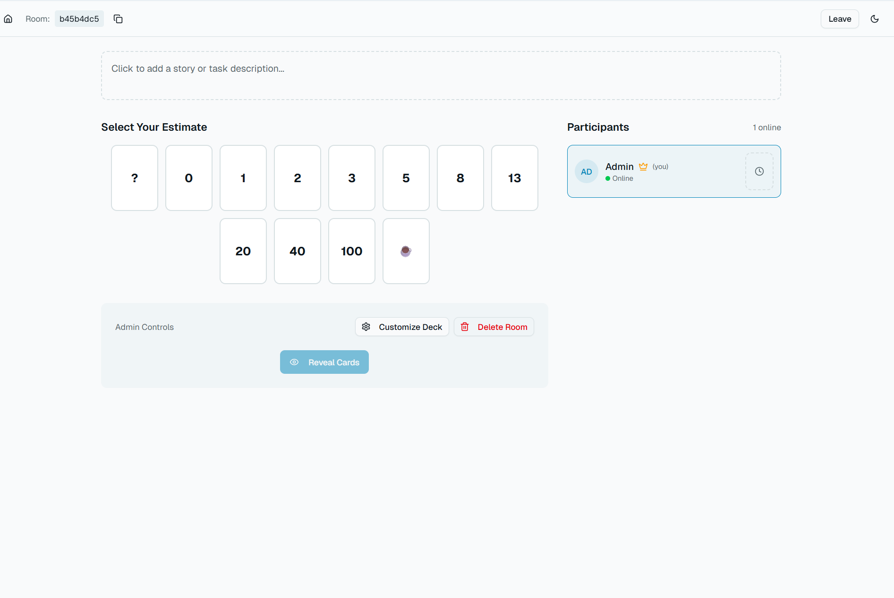

# Scrum Poker

Scrum Poker (Planning Poker): self-hosted web application for task estimation in Agile teams

This is a lightweight, modern, and fully self-hosted application for conducting Scrum Poker / Planning Poker sessions. Created specifically for small teams (5–10 people) to quickly and conveniently estimate user stories, tasks, or sprint backlogs during planning.




## Key Features

- Room Creation

- Joining a Room

- Flexible Card Customization
  Default — classic Fibonacci + coffee + question mark.

- Voting

- Reveal
  Only admin presses the big "Reveal" button → all cards flip simultaneously

- Revoting After Reveal

- Round Reset

- Current Task Description

- Participant List
  Shows all connected people in real-time, their status (voted/not voted), admin can kick any participant (✕ or 🚪 button next to name).

- Admin Rights
  Only for room creator:  
  - card customization  
  - reveal / reset  
  - kick participants  
  - delete room entirely  
  Other participants only see card selection and results viewing.

- Automatic and Manual Room Deletion
  - Room lives exactly 6 hours from creation (automatically deleted from memory).  
  - Admin can delete room manually at any time ("Delete Room" button).

## Getting Started

### Local Development

1. Install dependencies:

   ```bash
   npm install
   # or
   yarn install
   # or
   pnpm install
   ```

2. Run the application:

   ```bash
   npm run dev
   # or
   yarn dev
   # or
   pnpm dev
   ```

3. Open [http://localhost:3000](http://localhost:3000) in your browser.

### Docker

1. Build the image:

   ```bash
   docker build -t scrum-poker .
   ```

2. Run the container:

   ```bash
   docker run -p 3000:3000 scrum-poker
   ```

### Vercel

Deploy on Vercel using their CLI or web interface.

## Perfect For

Small teams that want quick Planning Poker without accounts, subscriptions, ads, or cloud dependencies. Everything stays within your network/VPN.
